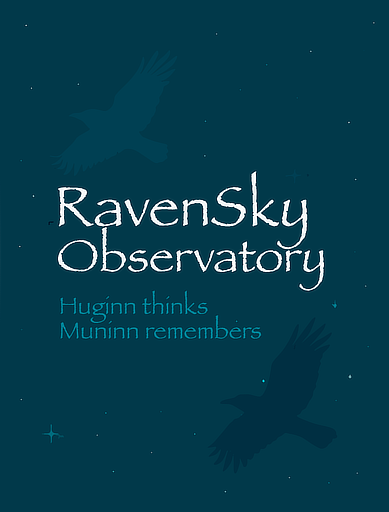

# AstroMuninn Downloads

Public binary distribution repository for **AstroMuninn**, published by **RavenSky Observatories**.

This repository contains:

- Release assets for supported platforms
- `SHA256SUMS.txt` checksum files
- Download and install instructions
- Public release notes
- Stable installer entry points

Source code is proprietary and not publicly available.

## AstroMuninn



**AstroMuninn** is a command-line tool for organizing astrophotography images into a structured, metadata-driven hierarchy.

Designed for real observatory workflows, AstroMuninn extracts metadata directly from FITS and XISF files and organizes your imaging sessions by target, filter, date, and other attributes automatically.

**Let AstroMuninn remember.**

---

# Why AstroMuninn?

Astrophotography generates thousands of files across multiple nights, targets, filters, cameras, and telescope configurations. Without a consistent storage strategy, sessions become fragmented across disks, shares, and backup volumes. Over time, it becomes surprisingly easy to forget where the data for a particular target actually lives.

AstroMuninn helps you remember.

It does not invent an organizational philosophy for you unless the simple default hierarchy meets your needs. Instead, it gives you the tools to implement **your** strategy using metadata-driven organization and N.I.N.A.-compatible path templates.

The result is a deterministic, repeatable folder structure built from the image file headers themselves, not from inconsistent filenames.

AstroMuninn:

* Reads metadata directly from your image files
* Understands FITS and XISF formats
* Supports N.I.N.A. path templates
* Handles real-world edge cases, for example telescope vs mount naming differences
* Produces clean, consistent directory structures

It is built on top of the open-source **ravensky-astro** Rust libraries.

---

## The Name

Huginn and Muninn are the two ravens of Odin in Norse mythology. Their names mean *thought* (Huginn) and *memory* (Muninn). Each day they fly across the world and return with knowledge.

AstroMuninn serves a similar role in your observatory workflow:
it gathers what your imaging sessions already know and ensures that knowledge is not lost in your storage hierarchy.

RavenSky Observatory builds tools around this theme.

Huginn thinks. Muninn remembers.

---

## Features

* Scan source directories recursively
* Organize by target, date, filter, or custom hierarchy
* Support for moving or copying files
* Dry-run mode for safe previews
* **Monitor mode** for continuously ingesting newly written image files
* Support for N.I.N.A. path templates
* Automatic normalization of folder names (spaces to underscores)
* JSON configuration support
* Pure Rust implementation

---

## Monitor Mode

AstroMuninn can operate in **monitor mode**, continuously watching a directory and organizing files as they appear.

This is ideal for:

* Network share ingestion
* Observatory automation pipelines
* Moving data from a capture workstation to long-term storage
* Pairing with N.I.N.A.'s RoboCopy plugin
* Automatically relocating files from an ASIAIR export directory

Instead of reorganizing after the fact, AstroMuninn can enforce structure in near real time.

Monitor mode:

* Waits for new files to stabilize before processing
* Runs continuously until interrupted (`Ctrl-C`)
* Applies the same metadata-driven organization logic used in batch mode

---

## Supported Formats

* FITS (.fits, .fit, .fts)
* XISF (.xisf)

---

## Windows FITS Path-Length Note

On Windows, FITS file access in AstroMuninn and the ravensky-astro FITS APIs depends on CFITSIO (via `fitsio` / `fitsio-sys`). CFITSIO currently opens disk files using its `fopen`-based path handling (`file_openfile`), which in this environment follows the classic Windows path-length boundary.

Use full FITS paths shorter than 260 characters (`< 260`). At 260 or more, FITS open calls may fail.

This limitation is specific to FITS access through CFITSIO. XISF handling is not affected.

---

## Usage Instructions

See [UsageInstructions.md](UsageInstructions.md) for general instructions for how to use the various capabilities of AstroMuninn.

---

## Quick Install

macOS / Linux:

```bash
curl -fsSL https://raw.githubusercontent.com/dostergaard/AstroMuninn-downloads/main/install.sh | bash
```

Windows PowerShell:

```powershell
irm https://raw.githubusercontent.com/dostergaard/AstroMuninn-downloads/main/install.ps1 | iex
```

## Downloads

Download compiled binaries from the [Releases](https://github.com/dostergaard/AstroMuninn-downloads/releases) page.

Current supported targets:

- macOS Apple Silicon
- Windows x86_64 (MinGW)
- Linux x86_64

The installers default to user-space locations:

- macOS / Linux: `~/.local/bin`
- Windows: `%LOCALAPPDATA%\RavenSky\AstroMuninn\bin`

They verify release checksums before installing.

## Verify Downloads

Each release includes a `SHA256SUMS.txt` file.

Examples:

```bash
shasum -a 256 -c SHA256SUMS.txt
```

```powershell
Get-FileHash .\AstroMuninn-v0.9.1-windows-x86_64.zip -Algorithm SHA256
```

## Homebrew

AstroMuninn provides a custom Homebrew tap from this repo after the first public release has been published:

```bash
brew tap dostergaard/AstroMuninn-downloads https://github.com/dostergaard/AstroMuninn-downloads
brew install astromuninn
```

Homebrew uses the public release assets from this repository.

## Install

See [INSTALL.md](INSTALL.md) for platform-specific installation notes.

## License

AstroMuninn is licensed for personal / non-commercial use. See [LICENSE](LICENSE) for the full license text.
